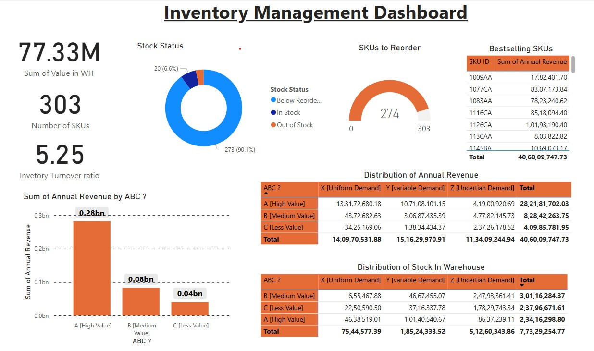

# Inventory Management Dashboard 📊

This Inventory Management Dashboard, built using Power BI, provides a comprehensive overview of key inventory metrics, facilitating data-driven decision-making. It showcases dynamic visuals and actionable insights that are essential for optimizing stock management.

## Dashboard Features

- **Total Warehouse Value:** ₹77.33M
- **Number of SKUs Tracked:** 303
- **Inventory Turnover Ratio:** 5.25

## Insights Provided

- **Stock Status:** 
  - Tracks SKUs that are in stock, below reorder levels, or out of stock.
  
- **SKUs to Reorder:** 
  - Identifies 274 SKUs that need restocking.
  
- **Bestselling SKUs:** 
  - Displays top-selling items along with their revenue.
  
- **ABC Analysis:** 
  - Classifies products based on their contribution to annual revenue:
    - **A:** High Value
    - **B:** Medium Value
    - **C:** Low Value

- **XYZ Analysis:**
  - Classifies products based on their consumption variability:
    - **X:** Items with stable demand and low variability.
    - **Y:** Items with moderate variability in demand.
    - **Z:** Items with high variability and unpredictable demand.

## Distribution Metrics

- **Revenue Analysis:** 
  - Breaks down revenue by product type and demand (Uniform, Variable, Uncertain).
  
- **Stock Distribution:** 
  - Visualizes stock distribution across different ABC and XYZ categories.
